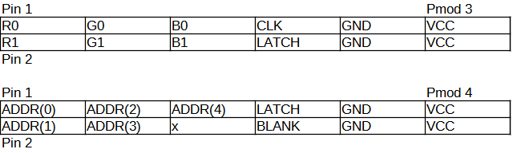

# Opallios

## Concept

This project is to make a decorative RGB LED display. This will use a HUB75 interface 64x64 RGB matrix. There will be an FPGA to drive the display, with an embedded linux device in order to render and send data to the FPGA.

## Required features

- Drive the RGB LED display at 30Hz
- Support 18 bit color
- Display gifs on loop
- Wall mounting 

## Additional features

- Drive the display at 60Hz or greater
- Support 24 bit color
- Render arbitrary data to framebuffer to draw, such as a 3d rotating object
- Include an accelerometer/gyro to allow for interactive elements, for example, a water simulation
- Support daisy chained displays
- Button(s) to switch between different displays
- Clock?
- Battery backup for real time clock
- Swivelable wall mount
- Global dimming

## Reference documentation

[Glen Akins' Very informative guide of the interface protocol](https://bikerglen.com/projects/lighting/led-panel-1up/)

[LED Matrix Purchase link w/ some info](https://www.aliexpress.com/item/2251832744994700.html)

[Some reverse-engineered documentation on similar LED matrices](https://github.com/esden/led-panel-docs)

[BeagleWire Wiki](https://elinux.org/BeagleBoard/BeagleWire)

[Beaglebone Reference Manual](https://github.com/beagleboard/beaglebone-black/wiki/System-Reference-Manual)

[Binary Coded Modulation](http://www.batsocks.co.uk/readme/art_bcm_1.htm)

# Detailed Description

## Panel Details

3mm LED pitch, 192mmx192mm total size, 64x64 RGB LEDs.

1/32 scan on a 64x64 grid array *probably* means that 2 rows of 64 are lit up at a time, indicates 2x 5-bit decoders for row decoding.

## Power consumption:  

From adafruit's 64x32 3mm pitch RGB panel * 2:  
22W maximum on 5v supply * 2 = 8.8 A max

From sparkfun 32x32 panel * 4:  
2A maximum * 4 = 8 A max

Beaglebone Black = 500mA  
FPGA power consumption varies, probably in 10s of mA range, but lets say 100mA for a plenty wide budget.  
max estimate 8.8 + 0.5 + 0.1 = 9.4 A

I will rate power supply for project at 5V 10 A.

## Part selection

I'm not looking to make any custom boards for this project, so this will use commercially available boards.
Options of connecting a FPGA to a respbeerry pi seem limited.

Glen Akins' project uses a beaglebone with a logibone fpga board, but this board is discontinued. A very similar board is the [BeagleWire](https://www.crowdsupply.com/qwerty-embedded-design/beaglewire).  

The beaglebone has a TI GPMC interface, allowing for a 16 bit data interface at 100MHz, plenty high speed for piping data to the FPGA. The BeagleWire repo has GPMC driver support and example programs for getting a baserow example, which will save effort on that interface.

For these reasons I will be using a BeagleBone Black as the host device and graphics generator and the BeagleWire cape as the driving FPGA.

## FPGA IO



## Bit budget

The iCE40HX4k FPGA on the beaglewire board has 80k (81920 bit) block RAM. This shall be used for the frame buffer to store the data to display on the LED array. To achieve 18 bit color, the full array will use 64 * 64 * 18 = 73728 (72k) bits for a frame buffer. If a background buffer is desired, the external 32Mb SDRAM can be used.

## Data Rates

### HUB75 Clock Rate

[Someone on adafruit forums drove a 16x32 matrix at 50MHz](https://forums.adafruit.com/viewtopic.php?f=47&t=26130&start=0)

FM6126 and ICN2037 (if those are a correct part) lists 30MHz as maximum clock rate

From 100MHz clock, will target 25MHz (divide by 4). Can go higher, but for anything other than 50MHz, will need to consider clock domain crossings and PLLs. I expect there will be a 100MHz -> 100MHz CDC at the GPMC interface, if a rate other than 25mhz is desired there may be additional CDCs between the 100MHz fpga logic and the HUB75 interface.

### LED Matrix Frame Rate

At 25MHz, clock period is 20ns.  
The LED matrix functions as 2 separate halves, having 2 channels of rgb input data, and 2 rows of LEDs get illuminated at a time. Therefore for time calculations we can treat it as a 64x32 module.

Because the LEDs are only on or off, I will be using binary coded modulation (BCM) to dim the brightness for the different values of our color.

- Load 1 row with bit 0 of the RGB value: 40ns * 64 clocks + x for blanking period and latch = 2560 + 40x ns  
- Delay 'A' Time  
- Load same row with bit 1 of the RGB value: 2560 + 40x ns  
- Delay '2*A' Time
- Load same row with bit 2 of the RGB value: 2560 + 40x ns  
- Delay '4*A' Time
- ...
- Load same row with bit 5 of the RGB value: 2560 + 40x ns  
- Delay '32*A' Time
- repeat above for next 31 rows

Single Frame time: (6 bits BCM * (2560+40x) ns + (1+2+4+8+16+32) * A ns) * 32 ) = 491520+7680x+2016A ns

Maximum framerate: FOR NOW assume x = 1, only 1 additional clock cycle. Assume A is the minimum duration of 64 clocks, 40ns*64=2560ns, and the shifting in happens simultaneously during this period:  
491520+2016*2560ns = 5652480 ns => 176.91496 Hz

To get a target 60hz refresh rate:  
491520+2016A = 16666667 ns (disgusting number, investigate other rates)  
A = 16175147/2016 = 8023.3864 ns (gross)

How about 50hz refresh rate:  
491520+2016A = 20000000 ns 
A = 609640/63 = 9676.8254 ns (gross)

To deal with these nasty refresh rate periods, there will be a frame rate timer which will sync the transitions to the next frame.

### GPMC frame transfer time

GPMC runs at 100MHz, so 10 ns clock period. GPMC has a 16-bit data bus, so assume one 16-bit register gets loaded in 1 clock cycle, and we are doing a continuous block write, so there should only be one start block of overhead.

If tight packing is used, the 18 bytes of data are transferred in repeating blocks of 9 16-bit register writes, containing 8 sets of 18-bit LED RGB data. With this method, the full 73728 bit array data is sent in 512 blocks of 16 * 9 = 144 bits.  

64 * 64 * 18 bits/LED = 73728 bits  
73728/16 = 4608 clocks = 46080 ns  


With loose packing, the 18 bit RGB data will be broken into register pairs, one containing R and G data, and the other containing B data. this transfers the 18 bits in 2 16 bit register writes, so the transfer time would be.  

64 * 64 LEDS * 2 clocks per LED = 8192 clocks = 81920 ns


The total minimum frame time is 5652480 ns, divide by 32 to get one row = 176640 ns. Our frame transfer time is then significantly less than the time to draw one row, so we should be able to load our full frame within one row. Because we have plenty of time to transfer the data, I will use loose packing, as it simplifies the design.

 Because we have to continuously draw to maintain color information, we don't want to write data until we immediately want to change it. By synchronizing this timing information, we could have a data transfer model like this :

- keep a frame switch timer, to indicate when to change frames.
- Once this timer goes high, continue drawing the current frame until row 31 and 63 are being drawn
- once row 31 and 63 are being drawn, signal in a register to start loading in the next frame for all addresses except those for rows 31 and 63
- finish drawing rows 31 and 63, start rows 0 & 32, flag this in a register
- load in color data for rows 31 and 63

There is a 32MB SDRAM on the board, I can use this to either achieve 24 bit color, or double buffer the frames. I probably still need sync registers to only write here at certain times.

## Programming the FPGA

```
cd BeagleWire/load-fw
sudo ./bw-spi.sh ../../fpga-loads/led_matrix_fpga_top_bitmap.bin
```

## Read/Write to FPGA

```
cd BeagleWire/bridge-lib
sudo ./memmap -a 0 -w 1234  # Write
sudo ./memmap -a 0          # Read
```

---
Development notes
---
when GPMC write to any in range of LED frame data, grab both data and address, and forward to custom shaped 4096 * 18 ram. decode from there using LSB of address whether it is RG or B data. Separate register space and RAM space, do 2 different decodings for these.

figure out how to do block writes on GPMC

make IO block and constraints
may need async_reg or false path from GPMC clock domain to 100M clock domain

select a accelerometer/gyro


## Parts List
| Part | Qty | Purchased |
| --- | --- | --- |
| [64x64 Matrix Display](https://www.aliexpress.com/item/2251832744994700.html) | 1 | 2 |
| [5V 10A Wall power supply](https://www.aliexpress.com/item/3256802546767846.html) | 1 | 2 |
| [5.5x2.5mm DC barrel jack to screw terminal adapter](https://www.aliexpress.com/item/2251832639416404.html) | 1 | 2 |
| [Screw terminal to matrix power cable (incl. w/ matrix)](https://www.aliexpress.com/item/2251832744994700.html) | 1 | 2 |
| [Beaglebone Black](https://www.crowdsupply.com/crowd-supply/special-items) | 1 | 2 |
| [BeagleWire](https://www.crowdsupply.com/crowd-supply/special-items) | 1 | 2 |
| [5.5x2.5 barrel jack 2-way cable splitter](https://www.ebay.com/itm/252893935632) | 1 | 2 |